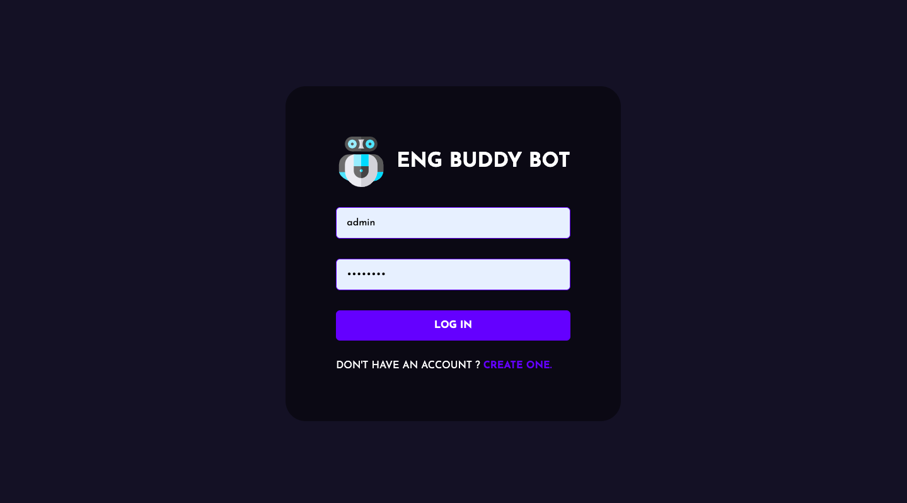

# Chat Application (Development stage)

# Project Idea
Creation of a platform for learning and practicing written English skills.

## Planned Features
- **Chat with Users:** Engage with users matching your English proficiency level.
- **Bot-Driven Chat:** Interact with a bot that assigns tasks to individual users or groups.
- **Task Generation:** Tasks are provided by the bot, sourced from a database or generated using AI.
- **Personal Dashboard:** Access to a personal account featuring statistics on completed tasks.

## Implemented Features
- **User Chat System:** A chat system for user interactions has been established.
- **Proficiency Level Segmentation:** Users are segmented into chats according to their English proficiency levels.





## Installation Guide

### Requirements
- [Nodejs](https://nodejs.org/en/download)
- [Mongodb](https://www.mongodb.com/docs/manual/administration/install-community/)

Both should be installed and make sure mongodb is running.

```shell
git clone <...>
cd <...>
```
Now rename env files from .env.example to .env
```shell
cd public
mv .env.example .env
cd ..
cd server
mv .env.example .env
cd ..
```

Now install the dependencies
```shell
cd server
yarn
cd ..
cd public
yarn
```
We are almost done, Now just start the development server.

For Frontend.
```shell
cd public
yarn start
```
For Backend.

Open another terminal in folder, Also make sure mongodb is running in background.
```shell
cd server
yarn start
```

Now open localhost:3000 in your browser.

## Contributing to the Project
I welcome contributions from fellow developers and value your input in making this platform more effective and user-friendly. If you're interested in contributing to our project, here are a few ways you can get involved:

- **Code Contributions:** If you have ideas for new features or notice any bugs, feel free to fork the repository, make your changes, and submit a pull request.
- **Feedback and Suggestions:** Your feedback is crucial for the continuous improvement of the platform. Share your thoughts and suggestions on features and user experience.
- **Collaborative Development:** We're open to collaboration with other developers. If you have a project or idea that aligns with our goals, let's discuss how we can work together.

To get started or if you have any questions, please reach out to us at redichkina.am@gmail.com.

